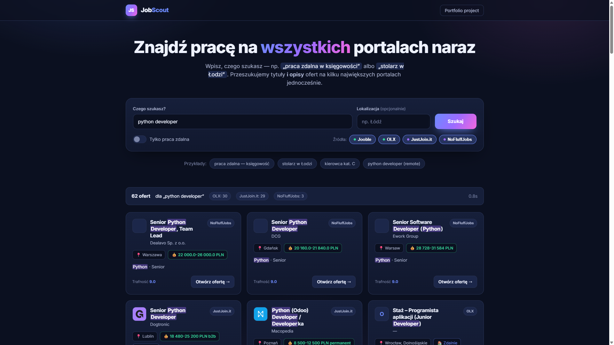

# JobScout 🎯

Wieloźródłowa wyszukiwarka ofert pracy. Użytkownik wpisuje czego szuka
(np. *„praca zdalna w księgowości”* albo *„stolarz w Łodzi”*), a aplikacja
**równolegle** przeszukuje kilka największych portali z ogłoszeniami —
analizując nie tylko tytuły, ale i **opisy** ofert — po czym prezentuje
wyniki posortowane według trafności.

Projekt portfolio: czysta architektura, asynchroniczny backend i nowoczesny
interfejs. Z założenia **odporny na awarie** — błąd jednego źródła nigdy nie
przerywa całego wyszukiwania.



---

## ✨ Funkcje

- 🔎 **Naturalne zapytania** — „praca zdalna w księgowości”, „stolarz Łódź”, „python remote”.
  Aplikacja sama wyłuskuje słowa kluczowe, lokalizację i tryb zdalny.
- 🌐 **Wiele źródeł naraz** — Jooble (agregator, wszystkie branże), OLX Praca,
  JustJoin.it i NoFluffJobs (IT).
- 📝 **Przeszukiwanie tytułów i opisów** — ranking trafności uwzględnia tytuł,
  firmę oraz treść ogłoszenia.
- ⚡ **Szybko i stabilnie** — komunikacja z publicznymi API JSON (bez przeglądarki),
  zapytania asynchroniczne, twarde limity czasu i pełna izolacja błędów.
- 🎨 **Nowoczesny UI** — responsywny, z podświetlaniem dopasowanych słów,
  filtrami źródeł, trybem zdalnym i stanami ładowania.

## 🏗️ Architektura

```
job_scrapper/
├── app/
│   ├── main.py            # FastAPI: API + serwowanie frontendu
│   ├── config.py          # Konfiguracja (.env)
│   ├── models.py          # Modele Pydantic
│   ├── matching.py        # Parsowanie zapytań, scoring, deduplikacja
│   ├── search.py          # Orkiestracja: równoległe odpytanie + ranking
│   └── scrapers/
│       ├── base.py        # Klasa bazowa: timeout + izolacja błędów
│       ├── jooble.py      # Jooble API (ogólne)
│       ├── olx.py         # OLX Praca API (ogólne)
│       ├── justjoin.py    # JustJoin.it API (IT)
│       └── nofluffjobs.py # NoFluffJobs API (IT)
├── frontend/              # index.html + styles.css + app.js (bez build-stepu)
├── requirements.txt
└── run.py                 # python run.py -> http://127.0.0.1:8000
```

Dodanie nowego portalu = jedna klasa dziedzicząca po `BaseScraper`
i wpis w `app/scrapers/__init__.py`.

## 🚀 Uruchomienie

```bash
# 1. Środowisko wirtualne
python -m venv venv
venv\Scripts\activate          # Windows
# source venv/bin/activate     # macOS / Linux

# 2. Zależności
pip install -r requirements.txt

# 3. (Opcjonalnie) konfiguracja
copy .env.example .env         # i uzupełnij JOOBLE_API_KEY

# 4. Start
python run.py
```

Następnie otwórz **http://127.0.0.1:8000**.

> OLX, JustJoin.it i NoFluffJobs działają **bez żadnych kluczy**.
> Jooble wymaga darmowego klucza API (https://pl.jooble.org/api/about) — wpisz go
> w pliku `.env` jako `JOOBLE_API_KEY`. Bez klucza źródło Jooble jest po prostu
> pomijane, a pozostałe portale działają normalnie. Klucze trzymamy wyłącznie
> w `.env` (jest w `.gitignore`), nigdy w kodzie.

### 🐳 Docker

```bash
docker build -t jobscout .
docker run -p 8000:8000 -e JOOBLE_API_KEY=twoj_klucz jobscout
```

Aplikacja będzie dostępna pod **http://localhost:8000**.

## 🔌 API

| Metoda | Endpoint        | Opis                                   |
|--------|-----------------|----------------------------------------|
| `GET`  | `/api/health`   | Status serwisu                         |
| `GET`  | `/api/sources`  | Lista dostępnych źródeł                 |
| `POST` | `/api/search`   | Wyszukiwanie ofert                      |

Przykład:

```bash
curl -X POST http://127.0.0.1:8000/api/search \
  -H "Content-Type: application/json" \
  -d "{\"query\": \"praca zdalna w księgowości\", \"remote_only\": true}"
```

Dokumentacja interaktywna (Swagger): **http://127.0.0.1:8000/docs**

## 🛠️ Stack

- **Backend:** Python 3.10+, FastAPI, httpx (async), Pydantic v2
- **Frontend:** czysty HTML/CSS/JS (zero build-stepu)
- **Źródła danych:** publiczne API JSON portali z ogłoszeniami

## ⚠️ Uwagi

Projekt edukacyjny / portfolio. Korzystaj z danych zgodnie z regulaminami
poszczególnych portali. Endpointy zewnętrznych API mogą się zmieniać —
dzięki izolacji błędów niedostępność jednego źródła nie wpływa na pozostałe.
